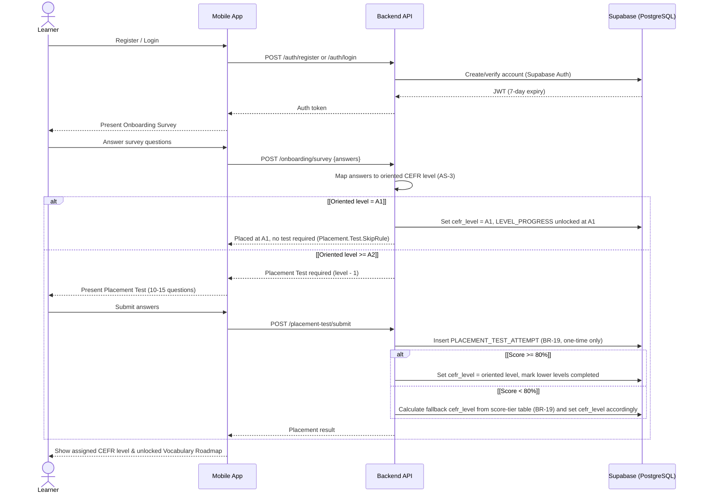

# Figure A-1

*Figure A-1. Sequence diagram for Onboarding and the CEFR Placement Test.*

Vị trí trong SE121-SRS v4.0: Appendix A, mục A.1.

```mermaid
sequenceDiagram
    actor L as Learner
    participant App as Mobile App
    participant API as Backend API
    participant DB as Supabase (PostgreSQL)
    L->>App: Register / Login
    App->>API: POST /auth/register or /auth/login
    API->>DB: Create/verify account (Supabase Auth)
    DB-->>API: JWT (7-day expiry)
    API-->>App: Auth token
    App-->>L: Present Onboarding Survey
    L->>App: Answer survey questions
    App->>API: POST /onboarding/survey {answers}
    API->>API: Map answers to oriented CEFR level (AS-3)
    alt [Oriented level = A1]
        API->>DB: Set cefr_level = A1, LEVEL_PROGRESS unlocked at A1
        API-->>App: Placed at A1, no test required (Placement.Test.SkipRule)
    else [Oriented level >= A2]
        API-->>App: Placement Test required (level - 1)
        App-->>L: Present Placement Test (10-15 questions)
        L->>App: Submit answers
        App->>API: POST /placement-test/submit
        API->>DB: Insert PLACEMENT_TEST_ATTEMPT (BR-19, one-time only)
        alt [Score >= 80%]
            API->>DB: Set cefr_level = oriented level, mark lower levels completed
        else [Score < 80%]
            API->>DB: Calculate fallback cefr_level from score-tier table (BR-19) and set cefr_level accordingly
        end
        API-->>App: Placement result
    end
    App-->>L: Show assigned CEFR level & unlocked Vocabulary Roadmap
```
