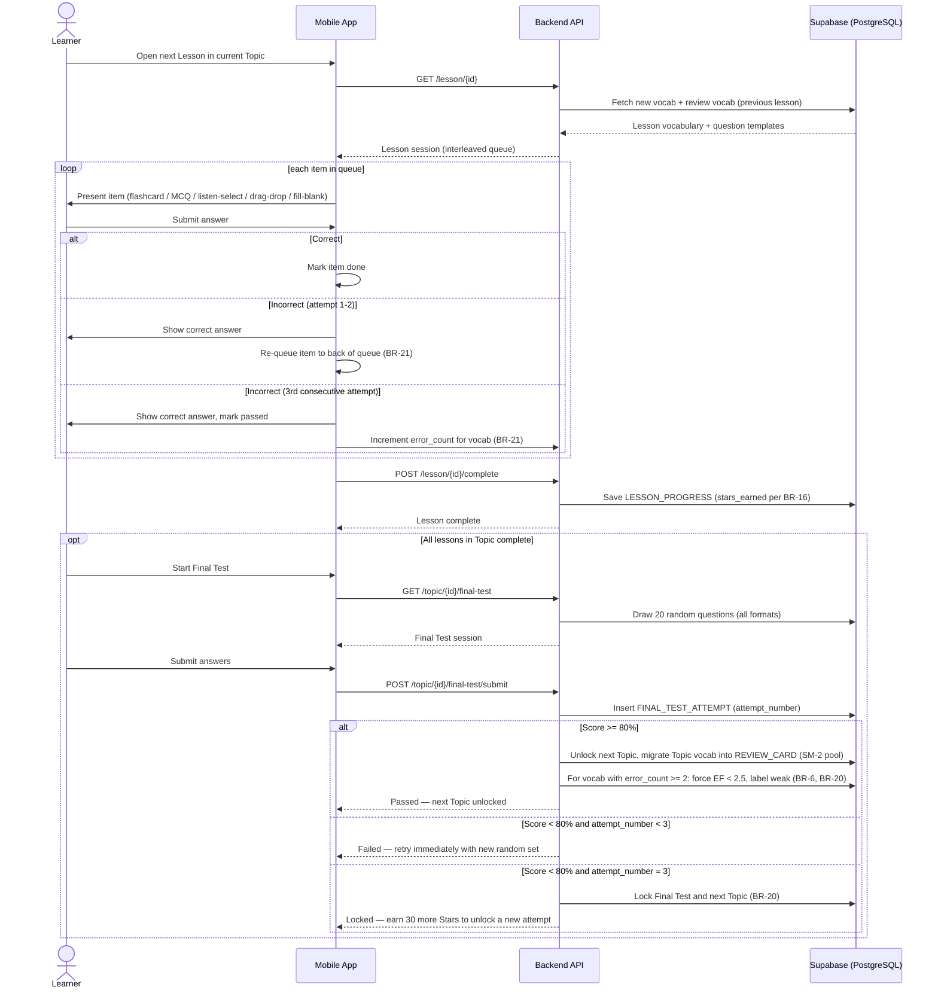

# Figure A-2

*Figure A-2. Sequence diagram for Lesson Practice and the Topic Final Test.*

Vị trí trong SE121-SRS v4.0: Appendix A, mục A.2.

```mermaid
sequenceDiagram
    actor L as Learner
    participant App as Mobile App
    participant API as Backend API
    participant DB as Supabase (PostgreSQL)
    L->>App: Open next Lesson in current Topic
    App->>API: GET /lesson/{id}
    API->>DB: Fetch new vocab + review vocab (previous lesson)
    DB-->>API: Lesson vocabulary + question templates
    API-->>App: Lesson session (interleaved queue)
    loop each item in queue
        App->>L: Present item (flashcard / MCQ / listen-select / drag-drop / fill-blank)
        L->>App: Submit answer
        alt Correct
            App->>App: Mark item done
        else Incorrect (attempt 1-2)
            App->>L: Show correct answer
            App->>App: Re-queue item to back of queue (BR-21)
        else Incorrect (3rd consecutive attempt)
            App->>L: Show correct answer, mark passed
            App->>API: Increment error_count for vocab (BR-21)
        end
    end
    App->>API: POST /lesson/{id}/complete
    API->>DB: Save LESSON_PROGRESS (stars_earned per BR-16)
    API-->>App: Lesson complete
    opt All lessons in Topic complete
        L->>App: Start Final Test
        App->>API: GET /topic/{id}/final-test
        API->>DB: Draw 20 random questions (all formats)
        API-->>App: Final Test session
        L->>App: Submit answers
        App->>API: POST /topic/{id}/final-test/submit
        API->>DB: Insert FINAL_TEST_ATTEMPT (attempt_number)
        alt Score >= 80%
            API->>DB: Unlock next Topic, migrate Topic vocab into REVIEW_CARD (SM-2 pool)
            API->>DB: For vocab with error_count >= 2: force EF < 2.5, label weak (BR-6, BR-20)
            API-->>App: Passed — next Topic unlocked
        else Score < 80% and attempt_number < 3
            API-->>App: Failed — retry immediately with new random set
        else Score < 80% and attempt_number = 3
            API->>DB: Lock Final Test and next Topic (BR-20)
            API-->>App: Locked — earn 30 more Stars to unlock a new attempt
        end
    end
```
