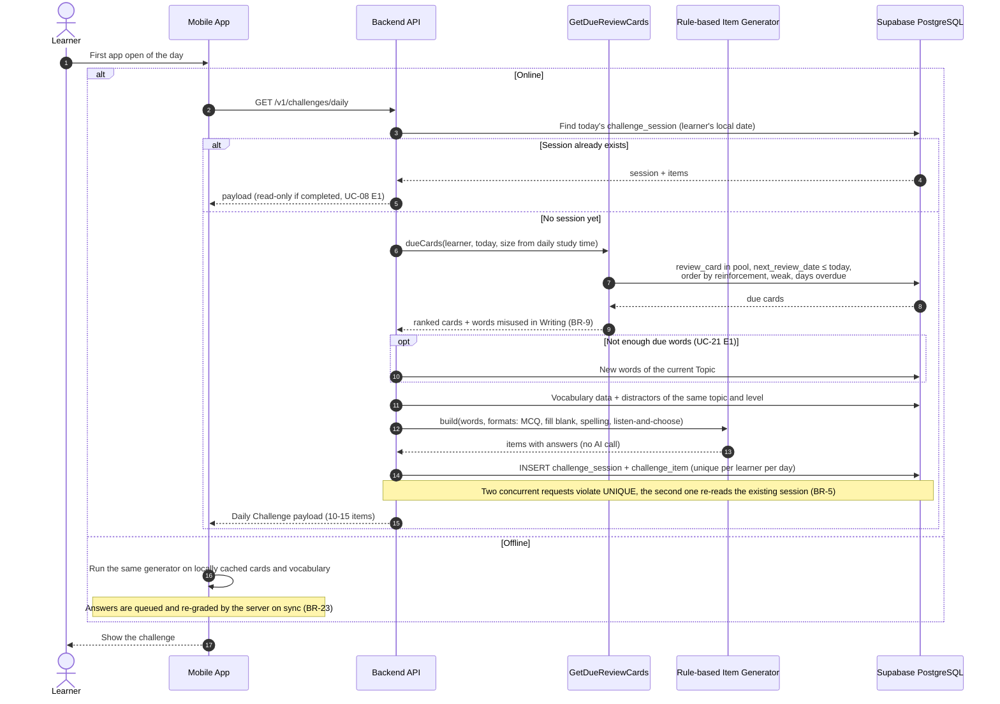

# Figure A-3

*Figure A-3. Sequence diagram for Daily Challenge generation (rule-based, also available offline).*

Vị trí trong SE121-SRS v4.0: Appendix A, mục A.3.

```mermaid
sequenceDiagram
    autonumber
    actor L as Learner
    participant App as Mobile App
    participant API as Backend API
    participant SRS as GetDueReviewCards
    participant GEN as Rule-based Item Generator
    participant DB as Supabase PostgreSQL
    L->>App: First app open of the day
    alt Online
        App->>API: GET /v1/challenges/daily
        API->>DB: Find today's challenge_session (learner's local date)
        alt Session already exists
            DB-->>API: session + items
            API-->>App: payload (read-only if completed, UC-08 E1)
        else No session yet
            API->>SRS: dueCards(learner, today, size from daily study time)
            SRS->>DB: review_card in pool, next_review_date ≤ today,<br/>order by reinforcement, weak, days overdue
            DB-->>SRS: due cards
            SRS-->>API: ranked cards + words misused in Writing (BR-9)
            opt Not enough due words (UC-21 E1)
                API->>DB: New words of the current Topic
            end
            API->>DB: Vocabulary data + distractors of the same topic and level
            API->>GEN: build(words, formats: MCQ, fill blank, spelling, listen-and-choose)
            GEN-->>API: items with answers (no AI call)
            API->>DB: INSERT challenge_session + challenge_item (unique per learner per day)
            Note over API,DB: Two concurrent requests violate UNIQUE, the second one re-reads the existing session (BR-5)
            API-->>App: Daily Challenge payload (10-15 items)
        end
    else Offline
        App->>App: Run the same generator on locally cached cards and vocabulary
        Note over App: Answers are queued and re-graded by the server on sync (BR-23)
    end
    App-->>L: Show the challenge
```
