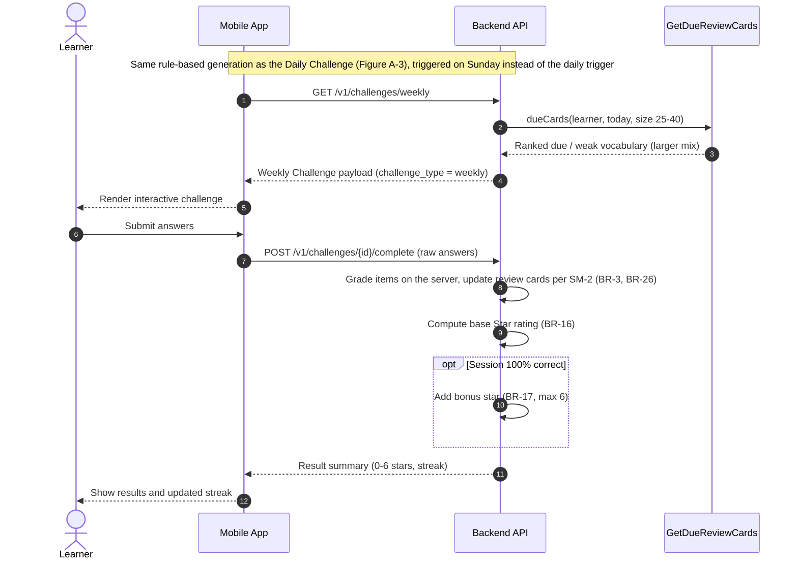

# Figure A-4

*Figure A-4. Sequence diagram for the Weekly Challenge, highlighting differences from the Daily Challenge.*

Vị trí trong SE121-SRS v4.0: Appendix A, mục A.4.

```mermaid
sequenceDiagram
    autonumber
    actor L as Learner
    participant App as Mobile App
    participant API as Backend API
    participant SRS as GetDueReviewCards
    Note over App,API: Same rule-based generation as the Daily Challenge (Figure A-3), triggered on Sunday instead of the daily trigger
    App->>API: GET /v1/challenges/weekly
    API->>SRS: dueCards(learner, today, size 25-40)
    SRS-->>API: Ranked due / weak vocabulary (larger mix)
    API-->>App: Weekly Challenge payload (challenge_type = weekly)
    App-->>L: Render interactive challenge
    L->>App: Submit answers
    App->>API: POST /v1/challenges/{id}/complete (raw answers)
    API->>API: Grade items on the server, update review cards per SM-2 (BR-3, BR-26)
    API->>API: Compute base Star rating (BR-16)
    opt Session 100% correct
        API->>API: Add bonus star (BR-17, max 6)
    end
    API-->>App: Result summary (0-6 stars, streak)
    App-->>L: Show results and updated streak
```
