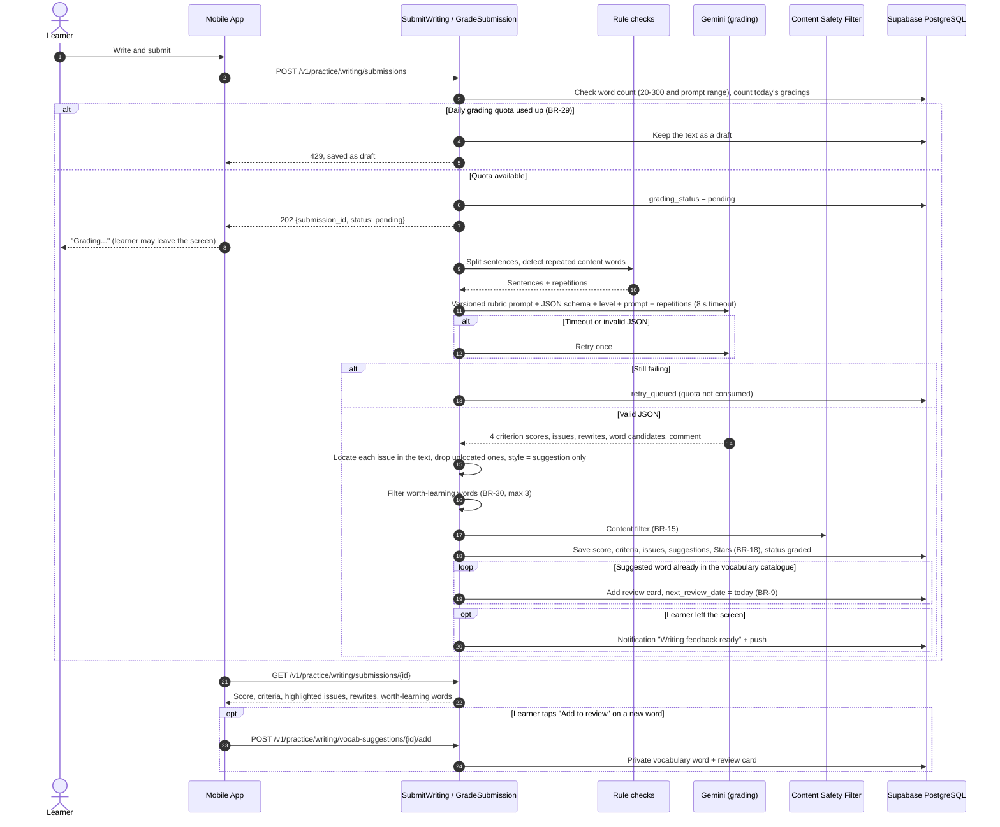

# Figure A-5

*Figure A-5. Sequence diagram for Writing submission and AI grading.*

Vị trí trong SE121-SRS v4.0: Appendix A, mục A.5.

```mermaid
sequenceDiagram
    autonumber
    actor L as Learner
    participant App as Mobile App
    participant API as SubmitWriting / GradeSubmission
    participant RULE as Rule checks
    participant LLM as Gemini (grading)
    participant SAF as Content Safety Filter
    participant DB as Supabase PostgreSQL
    L->>App: Write and submit
    App->>API: POST /v1/practice/writing/submissions
    API->>DB: Check word count (20-300 and prompt range), count today's gradings
    alt Daily grading quota used up (BR-29)
        API->>DB: Keep the text as a draft
        API-->>App: 429, saved as draft
    else Quota available
        API->>DB: grading_status = pending
        API-->>App: 202 {submission_id, status: pending}
        App-->>L: "Grading..." (learner may leave the screen)
        API->>RULE: Split sentences, detect repeated content words
        RULE-->>API: Sentences + repetitions
        API->>LLM: Versioned rubric prompt + JSON schema + level + prompt + repetitions (8 s timeout)
        alt Timeout or invalid JSON
            API->>LLM: Retry once
        end
        alt Still failing
            API->>DB: retry_queued (quota not consumed)
        else Valid JSON
            LLM-->>API: 4 criterion scores, issues, rewrites, word candidates, comment
            API->>API: Locate each issue in the text, drop unlocated ones, style = suggestion only
            API->>API: Filter worth-learning words (BR-30, max 3)
            API->>SAF: Content filter (BR-15)
            API->>DB: Save score, criteria, issues, suggestions, Stars (BR-18), status graded
            loop Suggested word already in the vocabulary catalogue
                API->>DB: Add review card, next_review_date = today (BR-9)
            end
            opt Learner left the screen
                API->>DB: Notification "Writing feedback ready" + push
            end
        end
    end
    App->>API: GET /v1/practice/writing/submissions/{id}
    API-->>App: Score, criteria, highlighted issues, rewrites, worth-learning words
    opt Learner taps "Add to review" on a new word
        App->>API: POST /v1/practice/writing/vocab-suggestions/{id}/add
        API->>DB: Private vocabulary word + review card
    end
```
