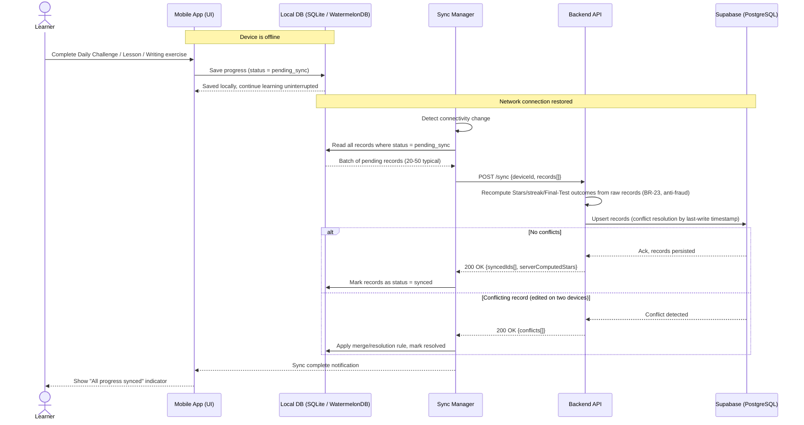

# Figure A-6

*Figure A-6. Sequence diagram for offline-first data synchronization, including server-side Star/streak revalidation (BR-23).*

Vị trí trong SE121-SRS v4.0: Appendix A, mục A.6.

```mermaid
sequenceDiagram
    actor L as Learner
    participant App as Mobile App (UI)
    participant LDB as Local DB (SQLite / WatermelonDB)
    participant SM as Sync Manager
    participant API as Backend API
    participant DB as Supabase (PostgreSQL)
    Note over App,LDB: Device is offline
    L->>App: Complete Daily Challenge / Lesson / Writing exercise
    App->>LDB: Save progress (status = pending_sync)
    LDB-->>App: Saved locally, continue learning uninterrupted
    Note over LDB,DB: Network connection restored
    SM->>SM: Detect connectivity change
    SM->>LDB: Read all records where status = pending_sync
    LDB-->>SM: Batch of pending records (20-50 typical)
    SM->>API: POST /sync {deviceId, records[]}
    API->>API: Recompute Stars/streak/Final-Test outcomes from raw records (BR-23, anti-fraud)
    API->>DB: Upsert records (conflict resolution by last-write timestamp)
    alt No conflicts
        DB-->>API: Ack, records persisted
        API-->>SM: 200 OK {syncedIds[], serverComputedStars}
        SM->>LDB: Mark records as status = synced
    else Conflicting record (edited on two devices)
        DB-->>API: Conflict detected
        API-->>SM: 200 OK {conflicts[]}
        SM->>LDB: Apply merge/resolution rule, mark resolved
    end
    SM-->>App: Sync complete notification
    App-->>L: Show "All progress synced" indicator
```
