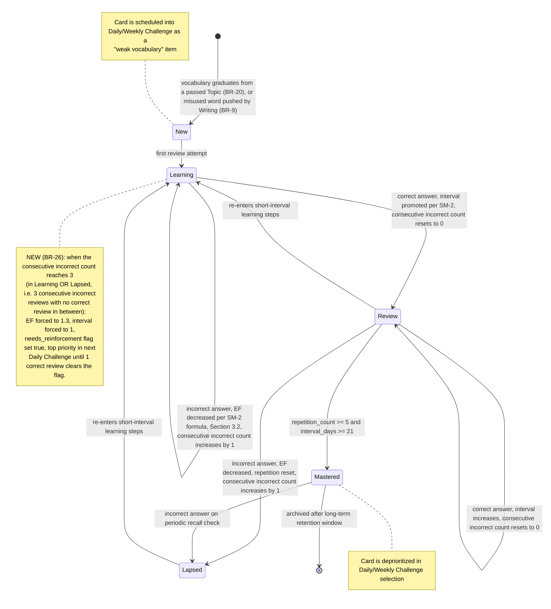

# Figure A-7

*Figure A-7. State diagram for the vocabulary review card lifecycle in the long-term SM-2 pool.*

Vị trí trong SE121-SRS v4.0: Appendix A, mục A.7.

```mermaid
stateDiagram-v2
    [*] --> New: vocabulary graduates from a passed Topic (BR-20), or misused word pushed by Writing (BR-9)
    New --> Learning: first review attempt
    Learning --> Learning: incorrect answer, EF decreased per SM-2 formula, Section 3.2, consecutive incorrect count increases by 1
    Learning --> Review: correct answer, interval promoted per SM-2, consecutive incorrect count resets to 0
    Review --> Review: correct answer, interval increases, consecutive incorrect count resets to 0
    Review --> Learning: re-enters short-interval learning steps
    Review --> Lapsed: incorrect answer, EF decreased, repetition reset, consecutive incorrect count increases by 1
    Review --> Mastered: repetition_count >= 5 and interval_days >= 21
    Lapsed --> Learning: re-enters short-interval learning steps
    Mastered --> Lapsed: incorrect answer on periodic recall check
    Mastered --> [*]: archived after long-term retention window
    note left of New
        Card is scheduled into Daily/Weekly Challenge as a
        "weak vocabulary" item
    end note
    note right of Learning
        NEW (BR-26): when the consecutive incorrect count reaches 3
        (in Learning OR Lapsed, i.e. 3 consecutive incorrect
        reviews with no correct review in between):
        EF forced to 1.3, interval forced to 1,
        needs_reinforcement flag set true, top priority in next
        Daily Challenge until 1 correct review clears the flag.
    end note
    note right of Mastered
        Card is deprioritized in Daily/Weekly Challenge selection
    end note
```
