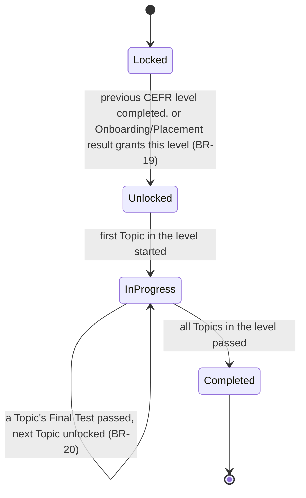

# Figure A-9

*Figure A-9. State diagram for CEFR level and Topic progression through the Vocabulary Roadmap.*

Vị trí trong SE121-SRS v4.0: Appendix A, mục A.9.

```mermaid
stateDiagram-v2
    [*] --> Locked
    Locked --> Unlocked: previous CEFR level completed, or Onboarding/Placement result grants this level (BR-19)
    Unlocked --> InProgress: first Topic in the level started
    InProgress --> InProgress: a Topic's Final Test passed, next Topic unlocked (BR-20)
    InProgress --> Completed: all Topics in the level passed
    Completed --> [*]
```
