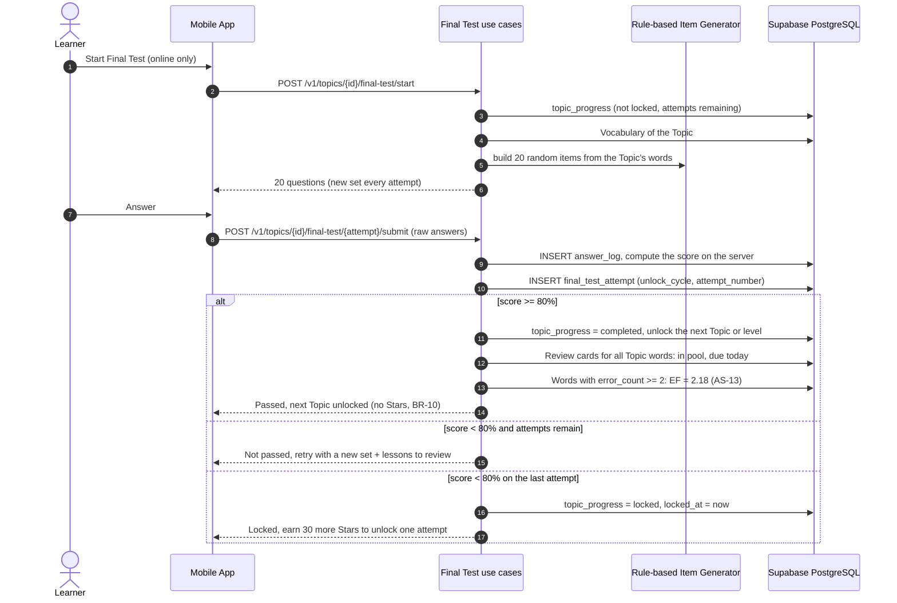

# Figure A-12

*Figure A-12. Sequence diagram for the Topic Final Test and graduation of its vocabulary into the SM-2 pool (BR-6, BR-20).*

Vị trí trong SE121-SRS v4.0: Appendix A, mục A.12.

```mermaid
sequenceDiagram
    autonumber
    actor L as Learner
    participant App as Mobile App
    participant API as Final Test use cases
    participant GEN as Rule-based Item Generator
    participant DB as Supabase PostgreSQL
    L->>App: Start Final Test (online only)
    App->>API: POST /v1/topics/{id}/final-test/start
    API->>DB: topic_progress (not locked, attempts remaining)
    API->>DB: Vocabulary of the Topic
    API->>GEN: build 20 random items from the Topic's words
    API-->>App: 20 questions (new set every attempt)
    L->>App: Answer
    App->>API: POST /v1/topics/{id}/final-test/{attempt}/submit (raw answers)
    API->>DB: INSERT answer_log, compute the score on the server
    API->>DB: INSERT final_test_attempt (unlock_cycle, attempt_number)
    alt score >= 80%
        API->>DB: topic_progress = completed, unlock the next Topic or level
        API->>DB: Review cards for all Topic words: in pool, due today
        API->>DB: Words with error_count >= 2: EF = 2.18 (AS-13)
        API-->>App: Passed, next Topic unlocked (no Stars, BR-10)
    else score < 80% and attempts remain
        API-->>App: Not passed, retry with a new set + lessons to review
    else score < 80% on the last attempt
        API->>DB: topic_progress = locked, locked_at = now
        API-->>App: Locked, earn 30 more Stars to unlock one attempt
    end
```
