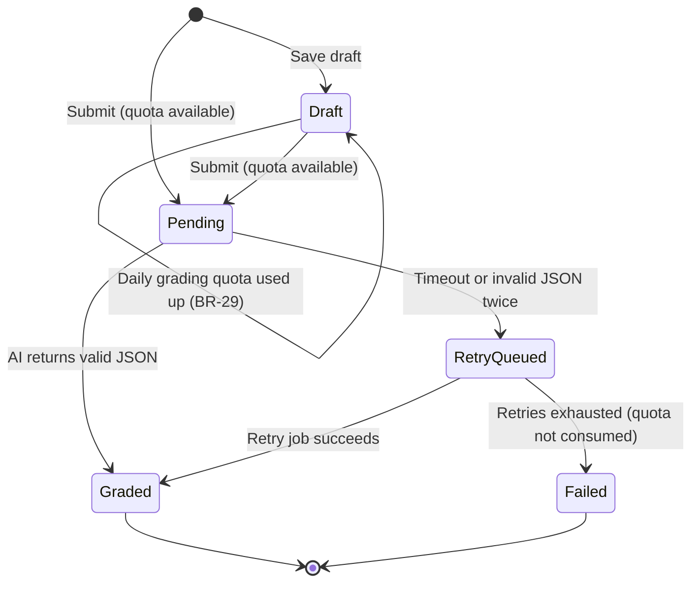

# Figure A-14

*Figure A-14. State diagram for a Writing submission (BR-29).*

Vị trí trong SE121-SRS v4.0: Appendix A, mục A.14.

```mermaid
stateDiagram-v2
    [*] --> Draft: Save draft
    [*] --> Pending: Submit (quota available)
    Draft --> Pending: Submit (quota available)
    Draft --> Draft: Daily grading quota used up (BR-29)
    Pending --> Graded: AI returns valid JSON
    Pending --> RetryQueued: Timeout or invalid JSON twice
    RetryQueued --> Graded: Retry job succeeds
    RetryQueued --> Failed: Retries exhausted (quota not consumed)
    Graded --> [*]
    Failed --> [*]
```
