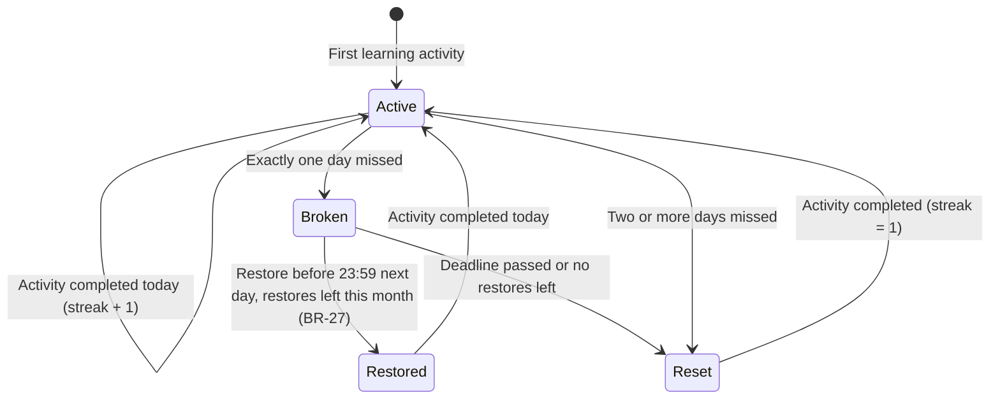

# Figure A-15

*Figure A-15. State diagram for the streak and streak restore (BR-11, BR-27).*

Vị trí trong SE121-SRS v4.0: Appendix A, mục A.15.

```mermaid
stateDiagram-v2
    [*] --> Active: First learning activity
    Active --> Active: Activity completed today (streak + 1)
    Active --> Broken: Exactly one day missed
    Broken --> Restored: Restore before 23:59 next day, restores left this month (BR-27)
    Restored --> Active: Activity completed today
    Broken --> Reset: Deadline passed or no restores left
    Active --> Reset: Two or more days missed
    Reset --> Active: Activity completed (streak = 1)
```
