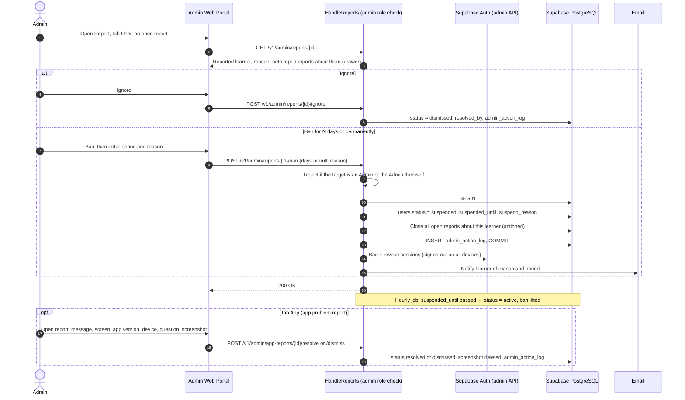

# Figure A-17

*Figure A-17. Sequence diagram for handling user reports (ban or ignore) and app problem reports (UC-29).*

Vị trí trong SE121-SRS v4.0: Appendix A, mục A.17.

```mermaid
sequenceDiagram
    autonumber
    actor A as Admin
    participant Web as Admin Web Portal
    participant API as HandleReports (admin role check)
    participant AUTH as Supabase Auth (admin API)
    participant DB as Supabase PostgreSQL
    participant MAIL as Email
    A->>Web: Open Report, tab User, an open report
    Web->>API: GET /v1/admin/reports/{id}
    API-->>Web: Reported learner, reason, note, open reports about them (drawer)
    alt Ignore
        A->>Web: Ignore
        Web->>API: POST /v1/admin/reports/{id}/ignore
        API->>DB: status = dismissed, resolved_by, admin_action_log
    else Ban for N days or permanently
        A->>Web: Ban, then enter period and reason
        Web->>API: POST /v1/admin/reports/{id}/ban {days or null, reason}
        API->>API: Reject if the target is an Admin or the Admin themself
        API->>DB: BEGIN
        API->>DB: users.status = suspended, suspended_until, suspend_reason
        API->>DB: Close all open reports about this learner (actioned)
        API->>DB: INSERT admin_action_log, COMMIT
        API->>AUTH: Ban + revoke sessions (signed out on all devices)
        API->>MAIL: Notify learner of reason and period
    end
    API-->>Web: 200 OK
    Note over API,DB: Hourly job: suspended_until passed → status = active, ban lifted
    opt Tab App (app problem report)
        A->>Web: Open report: message, screen, app version, device, question, screenshot
        Web->>API: POST /v1/admin/app-reports/{id}/resolve or /dismiss
        API->>DB: status resolved or dismissed, screenshot deleted, admin_action_log
    end
```
