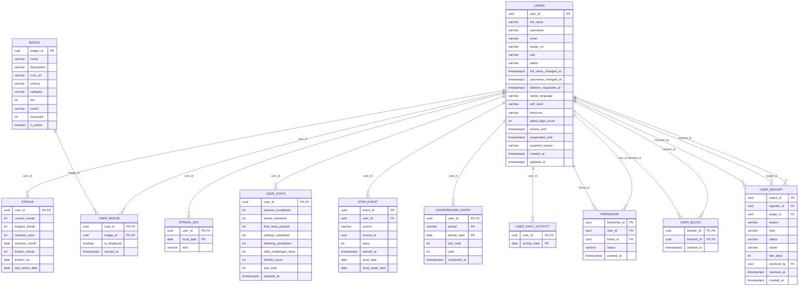

# Figure 4.1d

*Figure 4.1d. Logical entity-relationship diagram — (d) Gamification & social.*

Vị trí trong SE121-SRS v4.0: Mục 4.1 Logical Data Model.

```mermaid
erDiagram
    USERS {
        uuid user_id PK
        varchar full_name
        varchar username
        varchar email
        varchar avatar_url
        varchar role
        varchar status
        timestamptz full_name_changed_at
        timestamptz username_changed_at
        timestamptz deletion_requested_at
        varchar native_language
        varchar cefr_level
        varchar timezone
        int failed_login_count
        timestamptz locked_until
        timestamptz suspended_until
        varchar suspend_reason
        timestamptz created_at
        timestamptz updated_at
    }
    STREAK {
        uuid user_id PK,FK
        int current_streak
        int longest_streak
        int restores_used
        date restores_month
        int broken_streak
        date broken_on
        date last_active_date
    }
    STREAK_DAY {
        uuid user_id PK,FK
        date local_date PK
        varchar kind
    }
    BADGE {
        uuid badge_id PK
        varchar name
        varchar description
        varchar icon_url
        varchar criteria
        varchar category
        int tier
        varchar metric
        int threshold
        boolean is_active
    }
    USER_BADGE {
        uuid user_id PK,FK
        uuid badge_id PK,FK
        boolean is_displayed
        timestamptz earned_at
    }
    USER_STATS {
        uuid user_id PK,FK
        int lessons_completed
        int words_mastered
        int final_tests_passed
        int writings_submitted
        int listening_completed
        int daily_challenges_done
        int friends_count
        int star_total
        timestamptz updated_at
    }
    STAR_EVENT {
        uuid event_id PK
        uuid user_id FK
        varchar source
        uuid source_id
        int stars
        timestamptz earned_at
        date local_date
        date local_week_start
    }
    LEADERBOARD_ENTRY {
        uuid user_id PK,FK
        varchar period PK
        date period_start PK
        int star_total
        int rank
        timestamptz computed_at
    }
    USER_DAILY_ACTIVITY {
        uuid user_id PK,FK
        date activity_date PK
    }
    FRIENDSHIP {
        uuid friendship_id PK
        uuid user_id FK
        uuid friend_id FK
        varchar status
        timestamptz created_at
    }
    USER_BLOCK {
        uuid blocker_id PK,FK
        uuid blocked_id PK,FK
        timestamptz created_at
    }
    USER_REPORT {
        uuid report_id PK
        uuid reporter_id FK
        uuid target_id FK
        varchar reason
        varchar note
        varchar status
        varchar action
        int ban_days
        uuid resolved_by FK
        timestamptz resolved_at
        timestamptz created_at
    }
    USERS ||--o{ STREAK : "user_id"
    USERS ||--o{ STREAK_DAY : "user_id"
    USERS ||--o{ USER_BADGE : "user_id"
    BADGE ||--o{ USER_BADGE : "badge_id"
    USERS ||--o{ USER_STATS : "user_id"
    USERS ||--o{ STAR_EVENT : "user_id"
    USERS ||--o{ LEADERBOARD_ENTRY : "user_id"
    USERS ||--o{ USER_DAILY_ACTIVITY : "user_id"
    USERS ||--o{ FRIENDSHIP : "user_id"
    USERS ||--o{ FRIENDSHIP : "friend_id"
    USERS ||--o{ USER_BLOCK : "blocker_id"
    USERS ||--o{ USER_BLOCK : "blocked_id"
    USERS ||--o{ USER_REPORT : "reporter_id"
    USERS ||--o{ USER_REPORT : "target_id"
    USERS ||--o{ USER_REPORT : "resolved_by"
```
