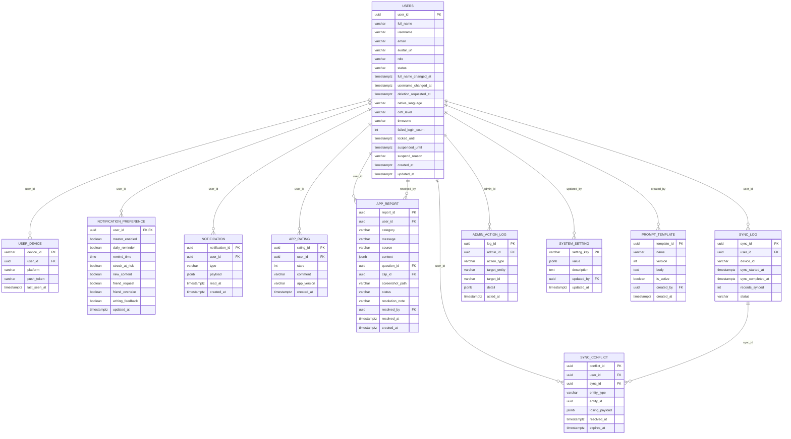

# Figure 4.1e

*Figure 4.1e. Logical entity-relationship diagram — (e) Notifications, offline sync & administration.*

Vị trí trong SE121-SRS v4.0: Mục 4.1 Logical Data Model.

```mermaid
erDiagram
    USERS {
        uuid user_id PK
        varchar full_name
        varchar username
        varchar email
        varchar avatar_url
        varchar role
        varchar status
        timestamptz full_name_changed_at
        timestamptz username_changed_at
        timestamptz deletion_requested_at
        varchar native_language
        varchar cefr_level
        varchar timezone
        int failed_login_count
        timestamptz locked_until
        timestamptz suspended_until
        varchar suspend_reason
        timestamptz created_at
        timestamptz updated_at
    }
    USER_DEVICE {
        varchar device_id PK
        uuid user_id FK
        varchar platform
        varchar push_token
        timestamptz last_seen_at
    }
    NOTIFICATION_PREFERENCE {
        uuid user_id PK,FK
        boolean master_enabled
        boolean daily_reminder
        time remind_time
        boolean streak_at_risk
        boolean new_content
        boolean friend_request
        boolean friend_overtake
        boolean writing_feedback
        timestamptz updated_at
    }
    NOTIFICATION {
        uuid notification_id PK
        uuid user_id FK
        varchar type
        jsonb payload
        timestamptz read_at
        timestamptz created_at
    }
    APP_RATING {
        uuid rating_id PK
        uuid user_id FK
        int stars
        varchar comment
        varchar app_version
        timestamptz created_at
    }
    APP_REPORT {
        uuid report_id PK
        uuid user_id FK
        varchar category
        varchar message
        varchar source
        jsonb context
        uuid question_id FK
        uuid clip_id FK
        varchar screenshot_path
        varchar status
        varchar resolution_note
        uuid resolved_by FK
        timestamptz resolved_at
        timestamptz created_at
    }
    SYNC_LOG {
        uuid sync_id PK
        uuid user_id FK
        varchar device_id
        timestamptz sync_started_at
        timestamptz sync_completed_at
        int records_synced
        varchar status
    }
    SYNC_CONFLICT {
        uuid conflict_id PK
        uuid user_id FK
        uuid sync_id FK
        varchar entity_type
        uuid entity_id
        jsonb losing_payload
        timestamptz resolved_at
        timestamptz expires_at
    }
    ADMIN_ACTION_LOG {
        uuid log_id PK
        uuid admin_id FK
        varchar action_type
        varchar target_entity
        varchar target_id
        jsonb detail
        timestamptz acted_at
    }
    SYSTEM_SETTING {
        varchar setting_key PK
        jsonb value
        text description
        uuid updated_by FK
        timestamptz updated_at
    }
    PROMPT_TEMPLATE {
        uuid template_id PK
        varchar name
        int version
        text body
        boolean is_active
        uuid created_by FK
        timestamptz created_at
    }
    USERS ||--o{ USER_DEVICE : "user_id"
    USERS ||--o{ NOTIFICATION_PREFERENCE : "user_id"
    USERS ||--o{ NOTIFICATION : "user_id"
    USERS ||--o{ APP_RATING : "user_id"
    USERS ||--o{ APP_REPORT : "user_id"
    USERS ||--o{ APP_REPORT : "resolved_by"
    USERS ||--o{ SYNC_LOG : "user_id"
    USERS ||--o{ SYNC_CONFLICT : "user_id"
    SYNC_LOG ||--o{ SYNC_CONFLICT : "sync_id"
    USERS ||--o{ ADMIN_ACTION_LOG : "admin_id"
    USERS ||--o{ SYSTEM_SETTING : "updated_by"
    USERS ||--o{ PROMPT_TEMPLATE : "created_by"
```
