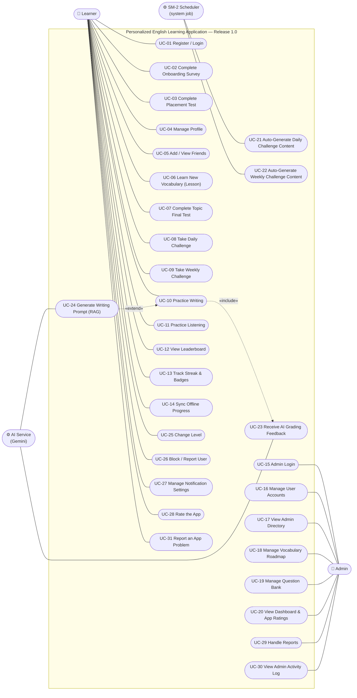

# Figure 3.1

*Figure 3.1. Use case diagram for Release 1.0.*

Vị trí trong SE121-SRS v4.0: Mục 3 System Features.

```mermaid
flowchart LR
    Learner(["👤 Learner"])
    Admin(["👤 Admin"])
    Sched(["⚙ SM-2 Scheduler<br/>(system job)"])
    AI(["⚙ AI Service<br/>(Gemini)"])
    subgraph SYS["Personalized English Learning Application — Release 1.0"]
        U01(["UC-01 Register / Login"])
        U02(["UC-02 Complete Onboarding Survey"])
        U03(["UC-03 Complete Placement Test"])
        U04(["UC-04 Manage Profile"])
        U05(["UC-05 Add / View Friends"])
        U06(["UC-06 Learn New Vocabulary (Lesson)"])
        U07(["UC-07 Complete Topic Final Test"])
        U08(["UC-08 Take Daily Challenge"])
        U09(["UC-09 Take Weekly Challenge"])
        U10(["UC-10 Practice Writing"])
        U11(["UC-11 Practice Listening"])
        U12(["UC-12 View Leaderboard"])
        U13(["UC-13 Track Streak & Badges"])
        U14(["UC-14 Sync Offline Progress"])
        U25(["UC-25 Change Level"])
        U26(["UC-26 Block / Report User"])
        U27(["UC-27 Manage Notification Settings"])
        U28(["UC-28 Rate the App"])
        U31(["UC-31 Report an App Problem"])
        U21(["UC-21 Auto-Generate Daily Challenge Content"])
        U22(["UC-22 Auto-Generate Weekly Challenge Content"])
        U23(["UC-23 Receive AI Grading Feedback"])
        U24(["UC-24 Generate Writing Prompt (RAG)"])
        U15(["UC-15 Admin Login"])
        U16(["UC-16 Manage User Accounts"])
        U17(["UC-17 View Admin Directory"])
        U18(["UC-18 Manage Vocabulary Roadmap"])
        U19(["UC-19 Manage Question Bank"])
        U20(["UC-20 View Dashboard & App Ratings"])
        U29(["UC-29 Handle Reports"])
        U30(["UC-30 View Admin Activity Log"])
    end
    Learner --- U01 & U02 & U03 & U04 & U05 & U06 & U07 & U08 & U09 & U10 & U11 & U12 & U13 & U14 & U25 & U26 & U27 & U28 & U31
    U10 -.->|"«include»"| U23
    U24 -.->|"«extend»"| U10
    Sched --- U21 & U22
    AI --- U23 & U24
    U15 & U16 & U17 & U18 & U19 & U20 & U29 & U30 --- Admin
    style SYS fill:#FFFDE7,stroke:#B8B000
```
